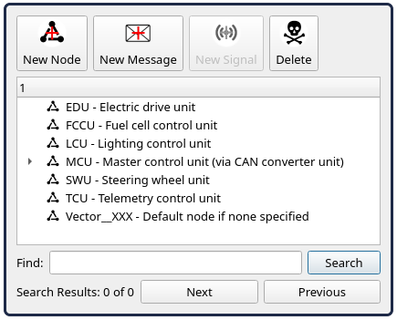

# lib-can-definitions

This repository serves as the central source of truth for CAN ID numbers and frame structures across hydrogreen projects. It is designed to be integrated as a git submodule to ensure all vehicle units remain synchronized.

## Getting started
To begin working with the definitions, add this repository as a git submodule within your project's `lib` or `modules` directory. For hardware testing, we use CAN 2.0 modules operating at 500k speed. We primarily use the [FYSETC UCAN](https://wiki.fysetc.com/docs/UCAN) adapter based on the STM32F072. You can find the latest definitions in the `hydrogreen-can-definitions.dbc` file.

If you are using a Canable-based device, refer to the [Canable getting started guide](https://canable.io/getting-started.html) for initial setup and to ensure your firmware is updated to the latest version.

## Diagnosis and monitoring
We use SavvyCAN for real-time bus analysis. Follow these steps to set up your environment:

1. Download [SavvyCAN](https://github.com/collin80/SavvyCAN/releases/tag/V220).
2. Download the [candleLight plugin](https://github.com/homewsn/candleLight_fw-SavvyCAN-Windows-plugin/releases/tag/v1.0) and extract artifacts to `C:/Program Files/SavvyCAN/canbus`.
3. Open `hydrogreen-can-definitions.dbc` via the DBC file manager.
4. Open the new connection dialog and select `QT SerialBus devices` as the connection type.
5. Set the serialbus device type to `candleLight_fw` and select the appropriate port (e.g., `gs_usb0`).

## System overview
The following image illustrates the current vehicle ECU topology:

